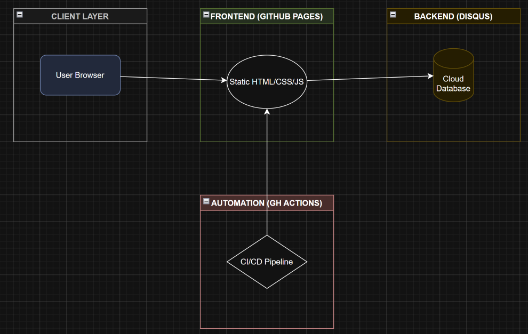

# 💍 Parents' 34th Anniversary Webpage

A premium, interactive, and 100% permanent digital celebration built as a gift for my parents' 34th wedding anniversary. This project demonstrates a transition from a local Python-based prototype to a professional, serverless cloud architecture.

## 🚀 Live Demo
**[Visit the Live Page](https://tundedamian.github.io/parents-anniversary/)**

## ✨ Features

- **Real-Time Anniversary Counter**: A dynamic JavaScript counter that calculates their marriage duration (Years, Months, Days, Hours) in real-time.
- **Premium 'Dark Pearl' Aesthetic**: Custom Vanilla CSS featuring glassmorphism, 3D tilt interactions (Vanilla JS), and responsive 'floating orb' backgrounds.
- **Global Guestbook**: Integrated **Disqus** for a cloud-hosted, real-time comment system that allows family members to post well-wishes from anywhere in the world.
- **Permanent Cloud Hosting**: Deployed using **GitHub Pages** with an automated **GitHub Actions** CI/CD pipeline, ensuring the site stays online forever without requiring a local server.
- **Legacy Preservation**: Migrated historical comments from a local prototype into a persistent HTML layout.

## 🛠️ Tech Stack

- **Frontend**: HTML5, Vanilla CSS3 (Custom Design System), Vanilla JavaScript (ES6+).
- **Backend/Storage**: Disqus (Cloud Guestbook).
- **CI/CD & Hosting**: GitHub Actions, GitHub Pages.
- **Design Patterns**: Mobile-first Responsive Design, Glassmorphism, Micro-animations.

## 📁 Project Evolution

This project originally started as a local project using a Python/Flask-style backend (`server.py`). To ensure 100% uptime and a permanent link, I refactored the architecture into a **fully static, serverless application**:

1. **Phase 1**: Local prototype with Python backend and JSON storage.
2. **Phase 2**: Refactored to Static HTML/CSS for speed and portability.
3. **Phase 3**: Integrated Disqus to replace the local Python server for cloud-based data persistence.
4. **Phase 4**: Automated deployment via GitHub Actions.

## 📝 License

Distributed under the MIT License. See `LICENSE` for more information.

---
*Created with love by [Tunde Damian](https://github.com/tundedamian)*
